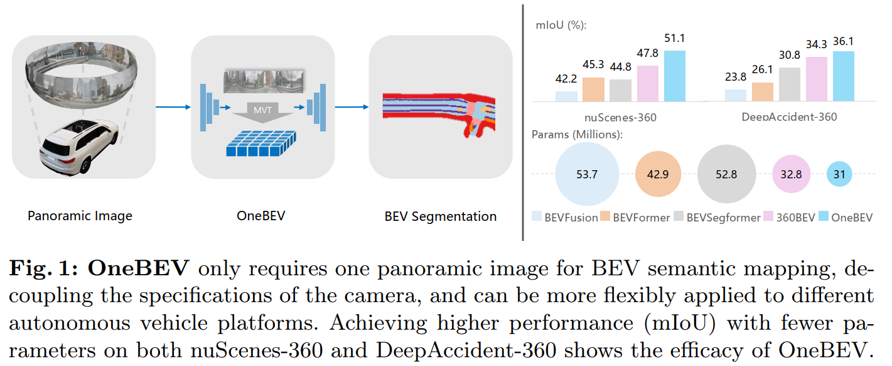

# OneBEV: Using One Panoramic Image for Bird's-Eye-View Semantic Mapping (ACCV 2024 Oral)
<p>
<a href="https://arxiv.org/pdf/2409.13912">
    </a>
<a href="https://pytorch.org/">
    </a>
<a href="https://github.com/open-mmlab/mmsegmentation">
    </a>
<a href="https://github.com/JialeWei/OneBEV/blob/main/LICENSE">
    </a>
</p>



## Updates
- [x] 11/2024, OneBEV is released.
- [x] 09/2024, init repository.

## Prerequisites
Please make sure your CUDA is >= 12.1.

## Environments
```bash
conda create -n onebev python=3.10.13
conda activate onebev

#mmcv install
pip install mmcv==2.1.0 -f https://download.openmmlab.com/mmcv/dist/cu121/torch2.1/index.html

#torch install
pip install torch==2.1.1 torchvision==0.16.1 torchaudio==2.1.1 --index-url https://download.pytorch.org/whl/cu121

#others
cd /path/to/onebev
pip install -r requirements.txt

#vmamba kernel install
cd onebev/models/backbones/kernels/selective_scan && pip install .
```
## Datasets
Prepare datasets:
- [NuScenes](https://www.nuscenes.org/nuscenes)
- [DeepAccident](https://deepaccident.github.io/)

Our extended datasets:
- NuScene-360 (41.77GB, ~51GB after extracted. **Download from [Google Drive](https://drive.google.com/drive/folders/1G5IvJO3j_ZdKFCVKu7M6RYQXwrSKDTMU?usp=sharing)**)
- DeepAccident-360 (55.27GB, ~57GB after extracted. **Download from [Google Drive](https://drive.google.com/drive/folders/1G5IvJO3j_ZdKFCVKu7M6RYQXwrSKDTMU?usp=sharing)**)

Data statistics of 360BEV datasets:

| Dataset  | Scene   | Frame | Category |
|-------------------|:---------------:|:----------------:|:-------------------:|
| train    |            700         |       28,130          |          6            |
| val      |            150         |        6,019          |          6            |
| **NuScene-360**   |   850         |       34,149          |          6            |
| train    |        483             |            40,619     |          17           |
| val      |         104            |              8,193    |          17           |
| **DeepAccident-360** |     587     |         48,812       |          17           |

The dataset folder structure is as follows:

```
OneBEV
├── onebev
├── configs
├── pretrained
│   ├── vssmtiny_dp01_ckpt_epoch_292.pth
├── data
│   ├── Nuscenes-360
│   │   ├── train
│   │   │   ├── *.jpg
│   │   ├── val
│   │   │   ├── *.jpg
│   │   ├── bev
│   │   │   ├── *.h5
│   │   ├── nusc_infos_train_mmengine.pkl
│   │   ├── nusc_infos_val_mmengine.pkl
│   ├── DeepAccident-360
│   │   ├── train
│   │   │   ├── *.jpg
│   │   ├── val
│   │   │   ├── *.jpg
│   │   ├── bev
│   │   │   ├── *.h5
│   │   ├── deep_infos_train_mmengine.pkl
│   │   ├── deep_infos_val_mmengine.pkl
├── tools
├── runs
├── README.md
```
## Checkpoints

**Download from [Google Drive](https://drive.google.com/drive/folders/1G5IvJO3j_ZdKFCVKu7M6RYQXwrSKDTMU?usp=sharing)**

## Usage

### Prepare
Please use the following command to generate pkl files and download pretrained weights for backbone:
```bash
cd /path/to/onebev
python tools/create_pkl/create_data.py <DATASET> --root-path <DATASET_PATH> --version trainval
bash pretrained/download.sh
```
`<DATASET>` should be 'nusc' or 'deep'.
`<DATASET_PATH>` should be the path of NuScenes-360 or DeepAccident-360.

### Train

Please use the following command to train the model:

```bash
bash tools/dist_train.sh configs/onebev/model_onebev_nusc_50epochs.py <GPU_NUM>
bash tools/dist_train.sh configs/onebev/model_onebev_deep_50epochs.py <GPU_NUM>
```

### Test

Please use the following command to test the model:

```bash
bash tools/dist_test.sh configs/onebev/model_onebev_nusc_50epochs.py <CHECKPOINT_PATH> <GPU_NUM>
bash tools/dist_test.sh configs/onebev/model_onebev_deep_50epochs.py <CHECKPOINT_PATH> <GPU_NUM>
```

`<CHECKPOINT_PATH>` should be the path of the checkpoint file.

## References
We appreciate the previous open-source works.
- [BEVFormer](https://github.com/fundamentalvision/BEVFormer)
- [VMamba](https://github.com/MzeroMiko/VMamba)
- [mmengine](https://github.com/open-mmlab/mmengine)
- [mmsegmentation](https://github.com/open-mmlab/mmsegmentation)

## Citation
If you are interested in this work, please cite as below:

```text
@inproceedings{wei2024onebev,
  title={OneBEV: Using One Panoramic Image for Bird's-Eye-View Semantic Mapping},
  author={Wei, Jiale and Zheng, Junwei and Liu, Ruiping and Hu, Jie and Zhang, Jiaming and Stiefelhagen, Rainer},
  booktitle={ACCV},
  year={2024}
}
```
